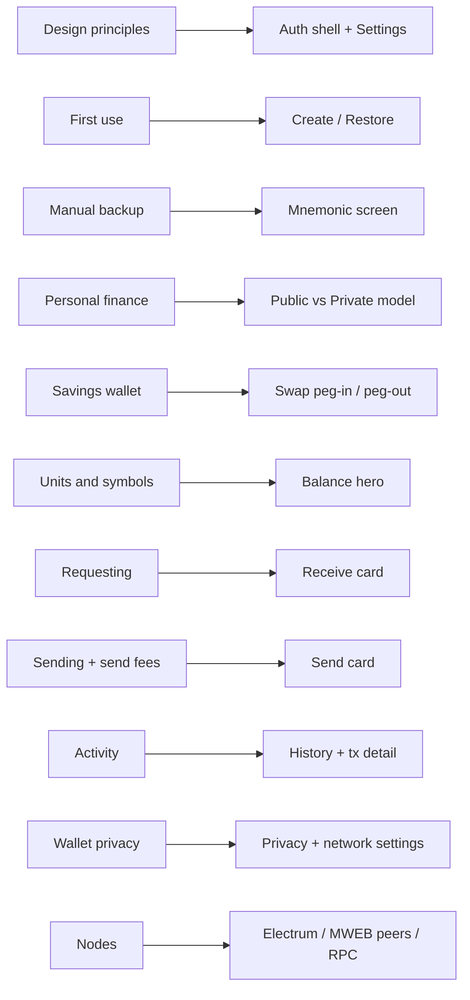

# UX review — Bitcoin Design Guide → Litecoin MWEB wallet backlog

Planning-only review of this Mac Litecoin wallet (Tauri + `wallet-core` + single-page UI) against the [Bitcoin Design Guide](https://bitcoin.design/guide/), adapted for Litecoin + MWEB (not Lightning). No implementation in this document.

**Product context:** Self-custody desktop wallet; BIP84 transparent (`ltc1`) + MWEB stealth (`ltcmweb1`). Flows: create/restore/unlock, Balance, Receive (Public/Private), Send, Swap (peg-in/peg-out), History, Settings. Sync: Electrum (transparent) + LIP-0006 peers (MWEB); litview is optional explorer/price/fees.

**Local sources of truth:** [`docs/CHAT_HANDOFF.md`](CHAT_HANDOFF.md), [`docs/LITVIEW.md`](LITVIEW.md), [`SECURITY.md`](../SECURITY.md), [`docs/ARCHITECTURE.md`](ARCHITECTURE.md), [`ui/index.html`](../ui/index.html), [`ui/src/main.ts`](../ui/src/main.ts), [`ui/src/styles.css`](../ui/src/styles.css), [`crates/wallet-core/src/`](../crates/wallet-core/src/).

**Adaptation rules used throughout:**

| Guide concept | This product |
| --- | --- |
| On-chain / base layer | Litecoin transparent (`ltc1`) |
| Privacy-preserving spend / confidential amounts | MWEB private send/receive (`ltcmweb1`) |
| “Move to private savings” | Peg-in (Swap Public → Private); ~6-block maturity |
| Exit to transparent | Peg-out (Swap Private → Public) |
| Lightning for privacy/speed | MWEB equivalents only — do not propose Lightning |
| Savings / upgradeable wallet (primary) | Desktop self-custody with progressive education |
| Daily spending wallet (secondary) | Flow patterns (backup quiz, request amount, fees, receive feedback) |

---

## 1. Executive summary

- **Verify the recovery phrase before “I saved it”.** The mnemonic screen is honor-system only ([`ui/index.html`](../ui/index.html) `#mnemonic`); there is no quiz and no later re-view API. A mistyped word is undetectable fund loss. Guide: [manual backup](https://bitcoin.design/guide/daily-spending-wallet/backup-and-recovery/manual-backup/).
- **Teach the Public / Private mental model early.** Balance, Receive, Send, and Swap already expose the split, but first-use never explains *when* to use Private or that peg-in funds mature. Map Guide [personal finance](https://bitcoin.design/guide/designing-products/personal-finance/) “savings vs spending” onto MWEB vs transparent — not onto Lightning.
- **Show peg-in maturity as state, not only prose.** `mweb_immature_sats` and `PeginResult.maturity_blocks` exist in [`dto.rs`](../crates/wallet-core/src/dto.rs) but the UI only appends `· maturing X LTC`. Users need spendable vs maturing and a countdown after peg-in.
- **Close the BIP21 interoperability gap.** Receive builds `litecoin:{address}` without amount/label; Send does not parse pasted URIs. Guide: [payment request formats](https://bitcoin.design/guide/how-it-works/payment-request-formats/), [requesting](https://bitcoin.design/guide/daily-spending-wallet/requesting/).
- **Make fees and confirmations legible.** Transparent send has three explorer chips and a solid review modal; still missing high-fee-vs-amount warnings, custom sat/vB, confirmation-time framing, and clearer peg-in dual-fee copy. Guide: [send fees](https://bitcoin.design/guide/daily-spending-wallet/sending/send-fees/).
- **Surface “payment received” and pending MWEB.** `SyncResult.new_txs` and `mweb_unconfirmed_sats` are available but underused — first deposit and private receives should feel acknowledged. Guide: [receiving](https://bitcoin.design/guide/daily-spending-wallet/requesting/receiving/), [first use](https://bitcoin.design/guide/daily-spending-wallet/first-use/).
- **Harden privacy progressively without redesigning the brand.** Keep sticky-until-used public addresses and stealth reuse for Private; add hide-balance, address-reuse warnings, and honest Settings copy about Electrum/litview IP leakage. Tor stays future architecture per [`SECURITY.md`](../SECURITY.md).
- **Prefer small, shippable UX increments.** Prefer UI-only or thin DTO surfacing before new `wallet-core` storage; label contacts, coin control, HW, and multi-wallet as P4 / future architecture against [`CHAT_HANDOFF.md`](CHAT_HANDOFF.md) out-of-scope.

---

## 2. Guide → app mapping

| Guide chapter | Primary app surfaces | Notes for Litecoin + MWEB |
| --- | --- | --- |
| [Design principles](https://bitcoin.design/guide/getting-started/principles/) | Auth shell, Settings, SECURITY.md | Self-custody, progressive security, privacy, transparency, nodes already partially honored |
| [Usage life cycle](https://bitcoin.design/guide/designing-products/usage-life-cycle/) | Boot → onboard → ready | First-use and regular-use phases; passionate-use = power Settings |
| [Personal finance](https://bitcoin.design/guide/designing-products/personal-finance/) | Balance hero, Public/Private toggles, Swap | Public ≈ interoperable “checking”; Private ≈ confidential savings |
| [Units & symbols](https://bitcoin.design/guide/designing-products/units-and-symbols/) | Balance, amount fields, fiat line | LTC + litoshis today; no unit preference |
| [First use](https://bitcoin.design/guide/daily-spending-wallet/first-use/) | `#onboarding`, `#mnemonic`, first sync | Responsibility disclaimer weak; no funding coach after create |
| [Manual backup](https://bitcoin.design/guide/daily-spending-wallet/backup-and-recovery/manual-backup/) | `#mnemonic` | Numbered grid present; verification missing |
| [Requesting](https://bitcoin.design/guide/daily-spending-wallet/requesting/) | `#card-receive` | Public QR + New address; Private stealth; no amount request |
| [Receiving](https://bitcoin.design/guide/daily-spending-wallet/requesting/receiving/) | Balance pending, History, toast | No dedicated “payment received” moment |
| [Sending](https://bitcoin.design/guide/daily-spending-wallet/sending/) / [send fees](https://bitcoin.design/guide/daily-spending-wallet/sending/send-fees/) | `#card-send`, review modal | Preview/confirm good; URI parse, fee warnings thin |
| [Activity](https://bitcoin.design/guide/daily-spending-wallet/activity/) | History, tx detail modal | Kind labels + confs; no notes/filters/export |
| [Wallet privacy](https://bitcoin.design/guide/how-it-works/wallet-privacy/) | Receive hints, Settings explorer/Electrum | Address hygiene OK; hide balance / Tor absent |
| [Payment request formats](https://bitcoin.design/guide/how-it-works/payment-request-formats/) | Receive QR, Send address field | BIP21 generate partial; parse none |
| [Coin selection](https://bitcoin.design/guide/how-it-works/coin-selection/) | Send (auto only) | BDK default; no UTXO API — P4 |
| [Nodes](https://bitcoin.design/guide/how-it-works/nodes/) | Settings Connection card | Electrum + MWEB peers + optional RPC; cross-checks exist |
| [Savings wallet](https://bitcoin.design/guide/savings-wallet/) | Overall product positioning | Multi-key / HW out of scope; friction + education still apply |
| [Upgradeable wallet](https://bitcoin.design/guide/upgradeable-wallet/) | Progressive security nudges | Map to passphrase strength, backup verify, later HW — not cloud backup |

**Skipped / deprioritized:** Lightning liquidity & LSPs (except privacy analogies), shared/inheritance/multi-key (future only), hardware categories beyond “out of scope for now” ([`CHAT_HANDOFF.md`](CHAT_HANDOFF.md)).

---

## 3. Gap matrix

Effort: **S** = UI copy/state only or thin DTO surfacing; **M** = multi-screen flow or small `wallet-core`/Tauri seam; **L** = new storage, networking, or architecture. Impact: **H** / **M** / **L**.

| Guide recommendation | Current behavior | Gap | Effort | Impact | Notes |
| --- | --- | --- | --- | --- | --- |
| Manual backup with **verification** ([manual backup](https://bitcoin.design/guide/daily-spending-wallet/backup-and-recovery/manual-backup/)) | Numbered phrase + “I saved it”; DOM cleared; no quiz ([`ui/index.html`](../ui/index.html) `#mnemonic`, [`main.ts`](../ui/src/main.ts) `renderMnemonic`) | No confirm user wrote phrase correctly | S–M | H | UI-only if verify before clear; re-view later needs core |
| Recovery phrase education + consequences ([manual backup](https://bitcoin.design/guide/daily-spending-wallet/backup-and-recovery/manual-backup/), [first use](https://bitcoin.design/guide/daily-spending-wallet/first-use/)) | Short lede: “shown once…” | Thin responsibility disclaimer; no screenshot warning; no spaced reminder | S | H | Copy + optional banner after first receive |
| Progressive security / passphrase quality ([principles — security](https://bitcoin.design/guide/getting-started/principles/#security)) | Passphrase required + match only; no meter | Weak passphrase → encryption gate weak; wipe is only forgot-path | S | H | UI guidance; no change to Argon2 params |
| Re-view / export seed behind auth ([savings](https://bitcoin.design/guide/savings-wallet/) recovery patterns) | No API; seed only in `CreateWalletResponse` | Cannot check backup later without restore risk | M | M | Needs guarded `wallet-core` command — open question |
| Prefer plain language; educate in context ([principles — inclusion](https://bitcoin.design/guide/getting-started/principles/#inclusion)) | Many good `.hint` / `.lede` strings | Jargon (MWEB, kernel, litoshis) sometimes unexplained | S | M | Especially Swap + first Private receive |
| Public/Private mental model ([personal finance](https://bitcoin.design/guide/designing-products/personal-finance/)) | Segment toggles on Receive/Send/Swap | No first-run coach; when to peg-in unclear | S–M | H | **MWEB-specific** |
| Peg-in maturity visible ([savings](https://bitcoin.design/guide/savings-wallet/) friction for large moves) | Prose “6 blocks”; `· maturing X LTC`; result `Matures in N blocks` | No countdown, no spendable vs maturing split, no home callout | S–M | H | **MWEB-specific**; data partly in DTOs |
| Surface unconfirmed MWEB | `mweb_unconfirmed_sats` in `CombinedSummary` unused in `renderCombined` | Private pending invisible | S | M | **MWEB-specific**; UI-only |
| Dual fees explained ([send fees](https://bitcoin.design/guide/daily-spending-wallet/sending/send-fees/)) | Peg-in preview shows miner + private network fees | Little education *why*; MWEB send fee opaque | S | M | **MWEB-specific** |
| MWEB explorer absence is success ([transparency](https://bitcoin.design/guide/getting-started/principles/#transparency)) | “not a transparent transaction — nothing to open…” | Reads as error | S | M | **MWEB-specific** copy |
| Unit preference + contextual toggle ([units](https://bitcoin.design/guide/designing-products/units-and-symbols/)) | LTC 8dp + litoshis subtitle; optional USD | No unit setting; no tap-to-cycle | S–M | M | Prefer LTC default for savings-like desktop |
| Hide balance ([wallet privacy](https://bitcoin.design/guide/how-it-works/wallet-privacy/), units hidden display) | Always visible when unlocked | Shoulder-surfing on desktop | S | M | UI-only |
| BIP21 amount/label/message on request ([requesting](https://bitcoin.design/guide/daily-spending-wallet/requesting/), [formats](https://bitcoin.design/guide/how-it-works/payment-request-formats/)) | `litecoin:{address}` only for public QR | Cannot request exact amount | S–M | M | UI can build URI; optional core validate |
| Parse `litecoin:` / pasted URI on send ([sending](https://bitcoin.design/guide/daily-spending-wallet/sending/)) | Raw address string; empty check in UI | Paste of QR text fails or ignores amount | S–M | H | Prefer small parser in UI or core |
| Fresh address per receive + reuse warning ([wallet privacy](https://bitcoin.design/guide/how-it-works/wallet-privacy/)) | Sticky until used + “New address”; Private reusable by design | No warn when *sending* to reused address | S–M | M | Send-side may need enrichment or local history |
| Fee urgency options + custom + overpay warn ([send fees](https://bitcoin.design/guide/daily-spending-wallet/sending/send-fees/)) | Fast / ~30m / ~1h chips; auto Electrum if unset | No economy/minimum; no custom; no fee≫amount warn | S | M | Ladder fields already in DTO |
| Review before send ([sending](https://bitcoin.design/guide/daily-spending-wallet/sending/)) | Strong review modals for send/pegin/pegout | Keep; tighten destination truncation / address type | S | H | Already good baseline |
| Received payment feedback ([receiving](https://bitcoin.design/guide/daily-spending-wallet/requesting/receiving/), [first use](https://bitcoin.design/guide/daily-spending-wallet/first-use/)) | Pending lines; auto-sync 60s; toasts for sync errors | No “you received X” celebration / first-fund coach | S | M | Use `new_txs` |
| Activity labels / notes ([activity](https://bitcoin.design/guide/daily-spending-wallet/activity/)) | Kind + time + confs + enrichment | No user notes | M–L | M | Needs storage — not in `meta.rs` today |
| Contacts ([payments contacts](https://bitcoin.design/guide/daily-spending-wallet/contacts/) patterns) | None | Convenience + privacy labeling deferred | L | L | P4; future architecture |
| Coin control ([coin selection](https://bitcoin.design/guide/how-it-works/coin-selection/)) | BDK auto; send-all/drain only | No UTXO list API | L | L | P4; needs `wallet-core` |
| Node choice + honesty ([nodes](https://bitcoin.design/guide/how-it-works/nodes/), [principles — decentralization](https://bitcoin.design/guide/getting-started/principles/#decentralization)) | Electrum URL, TLS, fallback, MWEB peers, RPC; tip/leafset cross-checks | Warnings often toast first only; education thin | S | M | Surface more warnings; keep defaults |
| Tor / proxy ([wallet privacy](https://bitcoin.design/guide/how-it-works/wallet-privacy/)) | Explicitly absent ([`SECURITY.md`](../SECURITY.md)) | Network privacy gap | L | M | Future architecture; LITVIEW Tor non-goal |
| Disclose third-party leakage ([wallet privacy](https://bitcoin.design/guide/how-it-works/wallet-privacy/), [`LITVIEW.md`](LITVIEW.md)) | Settings privacy hints + toggles for fiat/fees | Could be clearer on auto price poll + sqlite plaintext | S | M | Align with SECURITY accepted limits |
| Interoperability — restore formats ([principles — interoperability](https://bitcoin.design/guide/getting-started/principles/#interoperability)) | BIP39 / aezeed / xprv + MWEB scheme picker | Good; keep documenting schemes | — | — | Strength, not gap |
| Multi-key / HW progressive upgrade ([upgradeable](https://bitcoin.design/guide/upgradeable-wallet/), [savings](https://bitcoin.design/guide/savings-wallet/)) | Single-key encrypted mnemonic | Out of scope ([`CHAT_HANDOFF.md`](CHAT_HANDOFF.md)) | L | — | P4 future only |

---

## 4. Recommended changes (prioritized backlog)

Clustered by theme, ordered **P0 → P4**. Each item: user problem, proposed UX, acceptance criteria, UI vs `wallet-core`, non-goals.

### Theme index

| Theme | Items |
| --- | --- |
| Backup & recovery | P0-1, P0-2, P0-3 |
| Onboarding education | P1-1, P1-2 |
| Public/Private mental model | P1-1, P1-3, P1-4 |
| Payments | P0-4, P2-1, P2-2, P2-3, P2-4 |
| Privacy & networking | P3-1, P3-2, P3-3, P3-4 |
| Progressive security | P0-2, P1-5, P4-5 |
| Transparency / interoperability | P1-4, P2-2, P3-3 |
| Nice-to-haves | P4-* |

---

### P0 — Fund-loss / irreversible mistakes

#### P0-1 — Recovery phrase verification quiz

- **User problem:** Users can tap “I saved it” without writing the phrase; a wrong word is only discovered at restore time, after funds may exist. Guide: [manual backup — confirming a backup](https://bitcoin.design/guide/daily-spending-wallet/backup-and-recovery/manual-backup/).
- **Proposed UX:** After the numbered grid (`#mnemonic`), require confirmation: tap N random words in order (or fill blanks for positions 3, 7, 11…). Keep existing numbered chips. Soften CTA from “I saved it” to “Continue” only after success. Optional: one “Show phrase again” before verification completes (still same session; phrase still in memory from create).
- **Acceptance criteria:**
  - Create wallet cannot reach Balance until verification succeeds.
  - Wrong order shows clear error and lets retry without regenerating a new wallet.
  - Phrase DOM still cleared after success; restore flow still skips this screen.
- **Dependencies:** **UI-only** if verification uses the mnemonic already returned by `create_wallet`. No new Tauri command required for the happy path.
- **Non-goals:** Cloud backup; print template PDF; screenshot blocking (nice later on macOS); forcing restore users through a quiz.

#### P0-2 — Passphrase strength guidance

- **User problem:** Encryption passphrase is the only unlock gate; UI only checks non-empty + match. Forgotten passphrase → wipe + restore ([`SECURITY.md`](../SECURITY.md), unlock hint in [`ui/index.html`](../ui/index.html)). Guide: [principles — security](https://bitcoin.design/guide/getting-started/principles/#security), [first use — security setup](https://bitcoin.design/guide/daily-spending-wallet/first-use/).
- **Proposed UX:** On Create / Migrate / Restore passphrase fields: simple strength meter (length + charset heuristics) + short copy: “This passphrase unlocks the wallet on this Mac. It is not your recovery phrase. If you forget it, you must reset and restore from your written backup.” Keep confirm field.
- **Acceptance criteria:**
  - Meter updates as user types; does not block create on “weak” unless product chooses a hard minimum (open question).
  - Copy distinguishes wallet passphrase vs aezeed seed passphrase on restore.
- **Dependencies:** **UI-only**.
- **Non-goals:** Changing Argon2 parameters; biometric unlock; storing passphrase hints.

#### P0-3 — Post-backup / first-funds reminder

- **User problem:** Guide recommends reminding users to complete backup/security after deposits ([first use — security reminders](https://bitcoin.design/guide/daily-spending-wallet/first-use/)). After “I saved it” there is no later nudge.
- **Proposed UX:** Persist a local flag `backup_verified` (session/`localStorage` or `wallet_meta` boolean). If false *or* always for first N days: dismissible banner on Balance when `total_sats + mweb_total_sats > 0` — “Confirm your paper backup still matches — you cannot recover funds without it.” Link to Settings help copy (not necessarily re-reveal).
- **Acceptance criteria:** Banner appears at least once after first non-zero balance if verification was skipped (legacy wallets) or if product tracks incomplete verify; dismissible without blocking send.
- **Dependencies:** **UI-only** with `localStorage`, or **small meta field** in [`meta.rs`](../crates/wallet-core/src/meta.rs) if we want it to survive UI reset.
- **Non-goals:** Requiring passphrase + seed re-entry every session; nagging forever after dismiss + acknowledge.

#### P0-4 — Safer send confirmation (address + fee sanity)

- **User problem:** Broadcast is irreversible; UI validates empty address only; fee can dominate small amounts. Guide: [sending — review](https://bitcoin.design/guide/daily-spending-wallet/sending/), [send fees — high fee](https://bitcoin.design/guide/daily-spending-wallet/sending/send-fees/).
- **Proposed UX:**
  1. After `preview_send` / MWEB preview, show **full destination** (copyable), network type badge (`ltc1` vs `ltcmweb1`), amount, fee, and total leave-wallet.
  2. If `fee_sats >= 0.5 * amount_sats` (or fee > configurable floor), show warning callout before Confirm.
  3. Optional: passphrase re-auth for sends above a threshold (Settings) — progressive security, optional.
- **Acceptance criteria:**
  - Review modal always shows fee and destination without relying on truncated-only display.
  - High-fee warning appears for synthetic small-amount + high-rate case; user can still proceed.
- **Dependencies:** Mostly **UI-only** (preview DTOs already include fees). Threshold setting would be small `WalletMeta` addition.
- **Non-goals:** RBF/CPFP UI; blocking sends; hardware confirm.

---

### P1 — MWEB comprehension

#### P1-1 — First-use Public / Private coach

- **User problem:** Users meet “Private (MWEB)” without knowing it is confidential savings-like balance with maturity and interoperability limits. Guide: [personal finance](https://bitcoin.design/guide/designing-products/personal-finance/), [usage life cycle — first use](https://bitcoin.design/guide/designing-products/usage-life-cycle/#first-use).
- **Proposed UX:** After mnemonic verify (or first ready), one dismissible sheet (3 short panels):
  1. **Public** — `ltc1` addresses work with exchanges and most wallets; history is visible on explorers.
  2. **Private** — MWEB stealth addresses keep amounts/partners confidential among MWEB wallets.
  3. **Swap** — Moving Public → Private is a peg-in that matures after ~6 blocks before private spend.
  Keep Nexus visual language; no brand redesign.
- **Acceptance criteria:** Shown once (persisted dismiss); skippable; does not block sync; copy avoids Lightning analogies.
- **Dependencies:** **UI-only** (`localStorage` flag).
- **Non-goals:** Interactive tutorial covering every Settings field; forcing peg-in.

#### P1-2 — Funding path after empty wallet

- **User problem:** Empty wallet is not useful; Guide suggests clear receive/fund path ([first use — initial deposit](https://bitcoin.design/guide/daily-spending-wallet/first-use/)).
- **Proposed UX:** When balances are zero, Balance empty state CTA: “Receive Litecoin” → open Public receive; secondary: “I already have a backup” is restore (auth). One line: “Most exchanges pay to a public `ltc1` address. Move to Private later via Swap if you want confidentiality.”
- **Acceptance criteria:** Zero-balance state shows CTA; opening Receive generates/shows current public address + QR.
- **Dependencies:** **UI-only**.
- **Non-goals:** In-app exchange buy; submarine-swap analogies; auto peg-in of deposits.

#### P1-3 — Peg-in maturity as first-class state

- **User problem:** Maturity is critical; users may try to spend Private funds that are still maturing. Guide savings friction + our CHAT_HANDOFF peg-in model. **MWEB-specific.**
- **Proposed UX:**
  - Balance Private stat: split **Spendable** (`mweb_confirmed_sats`) vs **Maturing** (`mweb_immature_sats`) with plain copy “Available after ~6 confirmations.”
  - After peg-in result: keep `Matures in N blocks`; add link “View in History.”
  - Optional Progress: if tip height known, show “~N blocks remaining” using maturity constant + peg-in height from history when available.
  - Swap Public→Private: confirm detail already mentions maturity — elevate to a callout, not fine print.
- **Acceptance criteria:**
  - Maturing amount never included in Private “sendable” balance display used next to Send Private.
  - Peg-in result always states maturity.
  - `mweb_unconfirmed_sats` shown when > 0 (e.g. “Unconfirmed private”).
- **Dependencies:** **Mostly UI** using `CombinedSummary` + `PeginResult`. Per-coin countdown may need richer history fields later (label as enhancement).
- **Non-goals:** Changing consensus maturity; fine-window sync UI ([`CHAT_HANDOFF.md`](CHAT_HANDOFF.md) out of scope).

#### P1-4 — Swap fee coach + MWEB “no explorer” success copy

- **User problem:** Peg-in has two fees; private sends have kernel IDs that must not look broken. Guide: [send fees](https://bitcoin.design/guide/daily-spending-wallet/sending/send-fees/), [transparency](https://bitcoin.design/guide/getting-started/principles/#transparency). **MWEB-specific.**
- **Proposed UX:**
  - Peg-in confirm: labeled rows “Miner fee (public chain)” and “Private network fee (MWEB)” + one-sentence why.
  - Private send / peg-out result: replace failure-sounding explorer copy with “Private transfers are not listed on public explorers — that is expected. Keep the Kernel ID as your reference.”
  - Hide or disable “View on litview” for non-chain ids (already partially done); never open a 404.
- **Acceptance criteria:** Dual-fee labels always present on peg-in review; MWEB result never implies explorer failure.
- **Dependencies:** **UI-only**.
- **Non-goals:** Building an MWEB explorer; exposing raw peer logs.

#### P1-5 — Progressive security nudge (not multi-key)

- **User problem:** Upgradeable wallet Guide suggests leveling up security as balances grow; HW/multi-key are out of scope. Map to what we *can* do: backup verify, auto-lock, own Electrum, disable public fallback.
- **Proposed UX:** When combined balance exceeds a soft threshold (e.g. user-configurable or fixed like 1 LTC), show Settings checklist: backup verified, auto-lock ≠ 0, TLS verify on, understand wipe path. Inspired by [upgradeable wallet](https://bitcoin.design/guide/upgradeable-wallet/) without implementing HW.
- **Acceptance criteria:** Checklist is informational; no forced lockout of spend.
- **Dependencies:** **UI-only** (+ optional meta flag for “checklist dismissed”).
- **Non-goals:** Multi-key, cloud backup, hardware wallet integration ([`CHAT_HANDOFF.md`](CHAT_HANDOFF.md)).

---

### P2 — Payment polish

#### P2-1 — Unit display preference

- **User problem:** Eight decimal places are hard to scan; Guide recommends preferred unit + contextual toggle ([units & symbols](https://bitcoin.design/guide/designing-products/units-and-symbols/)).
- **Proposed UX:** Settings: display unit `LTC` | `litoshis` (and keep optional fiat under balance). Tap balance on hero cycles LTC ↔ litoshis ↔ hidden (if P3-1). Amount fields show active unit; convert on toggle with clear-on-switch if ambiguous (Guide pattern).
- **Acceptance criteria:** Preference persists; all primary balances and history list respect it; fiat remains optional via existing `show_fiat`.
- **Dependencies:** **UI-only** (or `WalletMeta` if syncing preference across reinstall is desired).
- **Non-goals:** BIP-177 “Ł-only” integer redesign; mLTC/μLTC; renaming chain units in consensus.

#### P2-2 — BIP21 request builder + send URI parse

- **User problem:** Interoperability gap — QR is address-only; pasted `litecoin:…?amount=` unused. Guide: [payment request formats](https://bitcoin.design/guide/how-it-works/payment-request-formats/), [requesting](https://bitcoin.design/guide/daily-spending-wallet/requesting/).
- **Proposed UX:**
  - Receive Public: optional Amount (LTC) + Label → QR encodes `litecoin:ADDR?amount=&label=`; Copy Address vs Copy Payment link.
  - Receive Private: keep raw stealth address (no false BIP21 claims unless a standard exists — do not invent).
  - Send: on paste/blur, if value matches `litecoin:` URI, fill address + amount; show toast “Parsed payment request.”
- **Acceptance criteria:**
  - QR with amount scans into a wallet that supports BIP21.
  - Pasting URI into Send fills fields; invalid URI shows friendly error.
  - Private path unchanged except clear copy that amount requests are Public-only for now.
- **Dependencies:** **UI can ship** a careful parser; optional **wallet-core** helper for validation consistency.
- **Non-goals:** Lightning invoices, LNURL, unified BIP321 multi-network QR, NFC.

#### P2-3 — Fee clarity (chips, custom, estimate)

- **User problem:** Fee market needs urgency framing; ladder already has unused fields; `estimate_fee` unused. Guide: [send fees](https://bitcoin.design/guide/daily-spending-wallet/sending/send-fees/).
- **Proposed UX:** Rename chips to time-oriented labels (keep sat/vB subtitle). Add Economy when `economy_sat_vb` present. Advanced: custom sat/vB. When hints disabled, call `estimate_fee` and show “Suggested ~N sat/vB.” Peg-in/MWEB: show fee in preview (already) + optional “why this fee” expander.
- **Acceptance criteria:** Custom rate flows into `SendRequest.fee_rate_sat_vb`; preview reflects it; economy chip hidden if null.
- **Dependencies:** **UI-only** against existing commands/DTOs.
- **Non-goals:** RBF; receiver-pays fee UX; changing default MWEB fee constants without a separate proposal.

#### P2-4 — Received-payment feedback

- **User problem:** First deposit and later receives should feel acknowledged ([receiving](https://bitcoin.design/guide/daily-spending-wallet/requesting/receiving/), [first use](https://bitcoin.design/guide/daily-spending-wallet/first-use/)).
- **Proposed UX:** On sync, if `new_txs > 0` or pending balances rise, toast success “Received funds — syncing details…” and pulse recent History row. First-ever receive: short modal “Funds arrived on Public. Use Swap to move to Private after they confirm, if you want.”
- **Acceptance criteria:** At least one visible signal beyond silent balance change within one auto-sync cycle of a detected receive.
- **Dependencies:** **UI-only** (`SyncResult.new_txs`, summary deltas).
- **Non-goals:** OS push notifications; watching addresses via litview ([`LITVIEW.md`](LITVIEW.md) never scan addresses).

---

### P3 — Privacy hardening

#### P3-1 — Hide balance

- **User problem:** Desktop shoulder surfing; Guide hidden display ([units](https://bitcoin.design/guide/designing-products/units-and-symbols/), [wallet privacy](https://bitcoin.design/guide/how-it-works/wallet-privacy/)).
- **Proposed UX:** Theme-adjacent control or balance long-press / Settings toggle “Hide balances.” Blur or replace amounts with `••••`; QR/receive still usable. Persist preference.
- **Acceptance criteria:** Balances and fiat hidden across Balance/Send segment chips; reveal requires explicit toggle (not merely hover).
- **Dependencies:** **UI-only**.
- **Non-goals:** Decoy balances; duress PIN.

#### P3-2 — Address reuse warnings (send-side)

- **User problem:** Reusing transparent addresses links history ([wallet privacy](https://bitcoin.design/guide/how-it-works/wallet-privacy/)). Receive already educates; send does not warn.
- **Proposed UX:** If destination equals a previously used receive/change address from local history/enrichment, warn “This address appears to have been used before.” Private stealth: no reuse warning (product teaches reuse is OK).
- **Acceptance criteria:** Warning for known reused transparent destination; Private send never shows transparent reuse warning.
- **Dependencies:** **UI** against `list_transactions` / enrichment; stronger detection may need **core** address-history API later.
- **Non-goals:** Blocking reuse; CoinJoin; PayJoin.

#### P3-3 — Network privacy disclosure (honest Settings)

- **User problem:** Users should understand Electrum learns addresses+IP; litview learns IP on price/fees; sqlite plaintext for transparent metadata ([`SECURITY.md`](../SECURITY.md), [`LITVIEW.md`](LITVIEW.md)).
- **Proposed UX:** Settings Connection + Explorer: short “What leaves this computer” panel mirroring the privacy matrix. Recommend FileVault. Keep toggles for `show_fiat` / fee hints. Show active Electrum server (already). Optionally default-off fiat poll is an open question — document tradeoff.
- **Acceptance criteria:** Panel visible without leaving the app; matches SECURITY/LITVIEW facts; no false “anonymous” claims.
- **Dependencies:** **UI-only**.
- **Non-goals:** Implementing Tor in this phase; embedding litecoind; litview address scan.

#### P3-4 — Transaction labels (lightweight)

- **User problem:** History is hard to parse without human context ([activity](https://bitcoin.design/guide/daily-spending-wallet/activity/)).
- **Proposed UX:** Optional note (≤140 chars) on send confirm and editable in tx detail. Store in a new non-secret sidecar (e.g. `tx_labels.json` next to meta, or field in meta map keyed by txid/wtxid). Display note in list meta line when present.
- **Acceptance criteria:** Label survives restart; wipe clears labels; labels never uploaded to litview.
- **Dependencies:** **wallet-core + Tauri** (storage API) — not UI-only. `meta.rs` today is settings-only.
- **Non-goals:** Full contacts; category budgeting charts; exporting tax CSV (P4).

---

### P4 — Later (future architecture / power features)

Labelled against [`CHAT_HANDOFF.md`](CHAT_HANDOFF.md) out-of-scope and Guide chapters deferred on purpose.

#### P4-1 — Contacts address book — **shipped**

- **User problem:** Repeated payments and privacy labeling ([contacts patterns](https://bitcoin.design/guide/daily-spending-wallet/contacts/)).
- **Proposed UX:** Named contacts with last-used address type (Public vs Private); pick on Send. Warn that transparent contacts link identity if reused carelessly.
- **Acceptance criteria:** CRUD contacts; send prefill; no network sync of contacts.
- **Shipped:** Wipeable `contacts.json` (name + one address + Public/Private); Settings CRUD; Send Contacts picker prefills and switches segment.
- **Non-goals:** BIP47 payment codes; social recovery; LNURL-style handles.

#### P4-2 — Coin control — **shipped (Public)**

- **User problem:** Advanced privacy/cost control ([coin selection](https://bitcoin.design/guide/how-it-works/coin-selection/)).
- **Proposed UX:** Opt-in UTXO picker on Public send; freeze coins; labels on UTXOs. Private side only if MWEB store can list coins safely.
- **Acceptance criteria:** Manual selection produces preview matching selected outpoints; default path remains automatic.
- **Shipped:** `list_unspent` / `set_utxo_locked`; `selected_outpoints` on Public Send and Public→Private Swap (peg-in); no UTXO labels; no MWEB picker.
- **Non-goals:** Making coin control default for beginners.

#### P4-3 — History search, filter, export — **shipped**

- **User problem:** Long lists; accounting ([activity](https://bitcoin.design/guide/daily-spending-wallet/activity/)).
- **Proposed UX:** Filter Public/Private/pending; search by note/txid; export CSV of non-secret fields.
- **Acceptance criteria:** Filters combine with labels; export excludes mnemonic/passphrase.
- **Shipped:** History toolbar filters/search; CSV/JSON export via native save dialog (`export_history`).
- **Non-goals:** Full accounting suite.

#### P4-4 — Multi-wallet / accounts

- **User problem:** Separate tip jar vs savings ([wallet privacy — multiple wallets](https://bitcoin.design/guide/how-it-works/wallet-privacy/), personal finance).
- **Proposed UX:** Multiple wallet files or account switcher.
- **Acceptance criteria:** Isolation of keys and history per wallet.
- **Dependencies:** **Major architecture** — out of scope today.
- **Non-goals:** Shipping in v0.2 polish.

#### P4-5 — Hardware wallets & multi-key

- **User problem:** Progressive security for large savings ([savings](https://bitcoin.design/guide/savings-wallet/), [upgradeable](https://bitcoin.design/guide/upgradeable-wallet/)).
- **Proposed UX:** Future PSBT / external signer flows.
- **Acceptance criteria:** TBD in a dedicated architecture RFC.
- **Dependencies:** Explicitly **out of scope** ([`CHAT_HANDOFF.md`](CHAT_HANDOFF.md)).
- **Non-goals:** Designing HW UX in this backlog beyond the placeholder.

#### P4-6 — Tor / proxy (future)

- **User problem:** IP leakage to Electrum, MWEB peers, litview ([wallet privacy](https://bitcoin.design/guide/how-it-works/wallet-privacy/), [`SECURITY.md`](../SECURITY.md)).
- **Proposed UX:** System proxy or embedded Tor toggle with latency warnings.
- **Acceptance criteria:** Unit/integration tests that traffic egresses via proxy when enabled.
- **Dependencies:** **Future architecture**; LITVIEW lists Tor for explorer as non-goal today — revisit holistically.
- **Non-goals:** Claiming anonymity while still using public Electrum without understanding tradeoffs.

---

### Phased roadmap (summary)

| Phase | Focus | Ship shape |
| --- | --- | --- |
| **P0** | Backup verify, passphrase guidance, send confirm safety | Mostly UI; highest fund-loss ROI |
| **P1** | Public/Private coach, maturity state, Swap fee / explorer copy | UI + existing DTOs |
| **P2** | Units, BIP21, fee chips/custom, receive feedback | UI (+ optional thin core parse) |
| **P3** | Hide balance, reuse warn, privacy panel, labels | Mix UI / small storage |
| **P4** | Contacts, coin control, export shipped; multi-wallet, HW, Tor deferred | Mixed / future architecture |

---

## 5. MWEB-specific design principles

Product rules derived from the Guide + this wallet’s Litecoin MWEB reality:

1. **Private is for confidential savings; Public is for interoperability.** Explain the split in personal-finance language, not as “Lightning but Litecoin.”
2. **Peg-in is a state change with a timer.** Never treat maturity as fine print; show spendable vs maturing.
3. **Every fee gets a name.** Miner fee vs private network fee; never a single unexplained “fee” when both apply.
4. **Do not force a network choice users cannot reason about — but never hide consequences.** Public/Private toggles are OK when each option states who can see what and when funds move.
5. **Absence from the public explorer means Private worked.** Kernel IDs are references, not failures.
6. **Stealth addresses may be reused; transparent addresses should not be.** Teach both in Receive hints (already started) and enforce with send-side warnings for transparent reuse.
7. **Exchanges fund Public first.** Default empty-state path is Receive Public → optional Swap later ([`CHAT_HANDOFF.md`](CHAT_HANDOFF.md) peg-in model).
8. **Educate in context.** Prefer Swap/Send callouts over a glossary dump ([principles — inclusion](https://bitcoin.design/guide/getting-started/principles/#inclusion)).
9. **Node and explorer choices are part of the product.** Electrum, MWEB peers, RPC, litview toggles are trust/privacy controls ([nodes](https://bitcoin.design/guide/how-it-works/nodes/), [`LITVIEW.md`](LITVIEW.md)) — explain them; do not bury them.
10. **Prefer small UX increments inside the Nexus visual language.** Copy, states, and flows before redesign; no Lightning feature proxies.

---

## 6. Open questions (maintainer decisions)

1. **Unit default:** Keep LTC as default (recommended for desktop savings-like use), or default to litoshis for small-balance users? Naming: keep **litoshis** in UI, or say **sats** for familiarity?
2. **Seed re-view:** Allow Settings → “Show recovery phrase” behind passphrase (new guarded `wallet-core` command), accepting expanded IPC/memory exposure? Or never re-show (current model) and rely on paper + verify-at-create only?
3. **Verification hardness:** Hard-gate create on quiz success (recommended), or allow skip with persistent scary banner (P0-3)?
4. **Passphrase policy:** Soft meter only, or enforce minimum length / score before Create/Migrate?
5. **Labels storage:** Sidecar JSON vs extend `wallet_meta.json` vs encrypted blob? Must remain wipeable and non-secret ([secrets not in sqlite](CHAT_HANDOFF.md) rule applies to mnemonic — labels should still not go to litview).
6. **Peg-in nudge:** After Public receive confirms, gently suggest Swap — or stay neutral to avoid fee surprise?
7. **Address reuse on send:** Warn only, or warn + require checkbox to proceed?
8. **Fiat / fee polling defaults:** Keep `show_fiat` and `use_explorer_fee_hints` default **on** (convenience) or default **off** (privacy-first)? ([`LITVIEW.md`](LITVIEW.md), [`SECURITY.md`](../SECURITY.md))
9. **High-fee threshold:** Is 50% of amount the right warn bar for Litecoin fee markets, or should it be fiat-relative?
10. **Tor priority:** When (if ever) to schedule P4-6 relative to notarized ship and MWEB E2E ([`CHAT_HANDOFF.md`](CHAT_HANDOFF.md) status)?
11. **Contacts scope:** ~~Names+addresses only, or also BIP21 payment links / Private stealth contacts in v1 of contacts?~~ **Decided:** name + one address + Public/Private type (shipped in P4-1).
12. **Auto-lock:** Remains UI-enforced (today) or move timer into `wallet-core` for stronger guarantees?

---

## Appendix A — Guide URLs referenced

- https://bitcoin.design/guide/getting-started/principles/
- https://bitcoin.design/guide/designing-products/usage-life-cycle/
- https://bitcoin.design/guide/designing-products/personal-finance/
- https://bitcoin.design/guide/designing-products/units-and-symbols/
- https://bitcoin.design/guide/daily-spending-wallet/first-use/
- https://bitcoin.design/guide/daily-spending-wallet/backup-and-recovery/manual-backup/
- https://bitcoin.design/guide/daily-spending-wallet/requesting/
- https://bitcoin.design/guide/daily-spending-wallet/requesting/receiving/
- https://bitcoin.design/guide/daily-spending-wallet/sending/
- https://bitcoin.design/guide/daily-spending-wallet/sending/send-fees/
- https://bitcoin.design/guide/daily-spending-wallet/activity/
- https://bitcoin.design/guide/how-it-works/wallet-privacy/
- https://bitcoin.design/guide/how-it-works/payment-request-formats/
- https://bitcoin.design/guide/how-it-works/coin-selection/
- https://bitcoin.design/guide/how-it-works/nodes/
- https://bitcoin.design/guide/savings-wallet/
- https://bitcoin.design/guide/upgradeable-wallet/

## Appendix B — Key local paths

| Path | Role |
| --- | --- |
| [`ui/index.html`](../ui/index.html) | Auth shell, Balance/Receive/Send/Swap/History/Settings structure & copy |
| [`ui/src/main.ts`](../ui/src/main.ts) | Phase machine, IPC, render, validation, modals |
| [`ui/src/styles.css`](../ui/src/styles.css) | Nexus-style visual language |
| [`crates/wallet-core/src/dto.rs`](../crates/wallet-core/src/dto.rs) | Summaries, previews, fee ladder, settings |
| [`crates/wallet-core/src/meta.rs`](../crates/wallet-core/src/meta.rs) | Settings-only meta (no labels today) |
| [`crates/wallet-core/src/app.rs`](../crates/wallet-core/src/app.rs) | Sync, send, peg-in/out, address reveal |
| [`src-tauri/src/lib.rs`](../src-tauri/src/lib.rs) | Tauri command surface |
| [`docs/CHAT_HANDOFF.md`](CHAT_HANDOFF.md) | Product decisions & out-of-scope |
| [`docs/LITVIEW.md`](LITVIEW.md) | Explorer privacy matrix & non-goals |
| [`SECURITY.md`](../SECURITY.md) | Threat model & accepted limitations |

---

*End of planning doc. Implementation should proceed as separate, small PRs starting at P0.*
